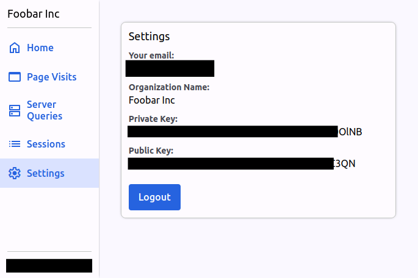

# Quick Start

The quick start assumes you're using Node.JS and Express on the backend, with React and React Router on the front-end.

If you need support for other frameworks, please [reach out](mailto:bill@privium.xyz).

## Get your public and private keys

Before you can install the library, you must sign up for an account and get your public and private keys from the
[Catalyst dashboard](https://app.catalystmonitor.com) on the "Settings" page.

## Example

For a working example, please see the [example repository](https://github.com/billliu1992/codebase-doctor-example).

If you just want to play with the dashboard, feel free to checkout the repo, and run the example with your own public and private keys.